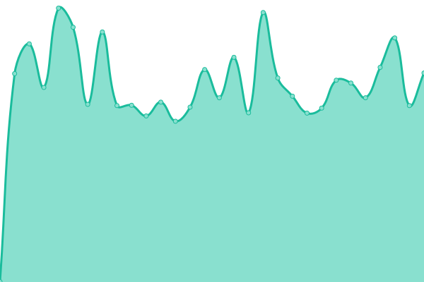

# [📈 Live Status](https://zateckar.github.io/status): <!--live status--> **🟧 Partial outage**

<!--start: status pages-->
<!-- This summary is generated by Upptime (https://github.com/upptime/upptime) -->
<!-- Do not edit this manually, your changes will be overwritten -->
<!-- prettier-ignore -->
| URL | Status | History | Response Time | Uptime |
| --- | ------ | ------- | ------------- | ------ |
|  IdP | 🟥 Down | [id-p.yml](https://github.com/zateckar/status/commits/HEAD/history/id-p.yml) | 

 1481ms
     
 | 

<a href="https://zateckar.github.io/status/history/id-p">99.78%</a>
    

|  OPP | 🟥 Down | [opp.yml](https://github.com/zateckar/status/commits/HEAD/history/opp.yml) | 

 595ms
     
 | 

<a href="https://zateckar.github.io/status/history/opp">99.99%</a>
    

|  OPT | 🟥 Down | [opt.yml](https://github.com/zateckar/status/commits/HEAD/history/opt.yml) | 

 490ms
     
 | 

<a href="https://zateckar.github.io/status/history/opt">99.99%</a>
    

|  OPD | 🟥 Down | [opd.yml](https://github.com/zateckar/status/commits/HEAD/history/opd.yml) | 

 467ms
     
 | 

<a href="https://zateckar.github.io/status/history/opd">100.00%</a>
    

|  AZP | 🟩 Up | [azp.yml](https://github.com/zateckar/status/commits/HEAD/history/azp.yml) | 

 663ms
     
 | 

<a href="https://zateckar.github.io/status/history/azp">100.00%</a>
    

|  AZT | 🟩 Up | [azt.yml](https://github.com/zateckar/status/commits/HEAD/history/azt.yml) | 

 661ms
     
 | 

<a href="https://zateckar.github.io/status/history/azt">100.00%</a>
    

|  AZD | 🟩 Up | [azd.yml](https://github.com/zateckar/status/commits/HEAD/history/azd.yml) | 

 656ms
     
 | 

<a href="https://zateckar.github.io/status/history/azd">100.00%</a>
    

|  Portal | 🟩 Up | [portal.yml](https://github.com/zateckar/status/commits/HEAD/history/portal.yml) | 

 748ms
     
 | 

<a href="https://zateckar.github.io/status/history/portal">100.00%</a>
    

<!--end: status pages-->

## 📄 License

- Powered by: [Upptime](https://github.com/upptime/upptime)
- Code: [MIT](./LICENSE) © [Anand Chowdhary](https://anandchowdhary.com), supported by [Pabio](https://pabio.com)
- Data in the `./history` directory: [Open Database License](https://opendatacommons.org/licenses/odbl/1-0/)
